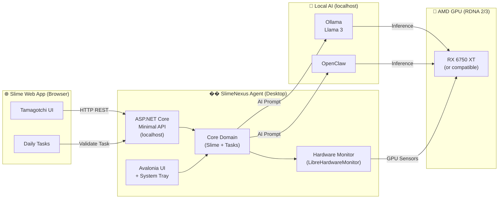

<div align="center">

<!-- Logo / Banner -->


# 🟢 SlimeNexus

**A cross-platform desktop agent that bridges your Slime Tamagotchi web experience with local AI tools — powered by .NET 9.**

[](https://github.com/ItaloKbb/SlimeNexus/actions/workflows/build-and-test.yml)
[](https://github.com/ItaloKbb/SlimeNexus/actions/workflows/release.yml)
[](LICENSE)
[](https://dotnet.microsoft.com/en-us/download/dotnet/9.0)
[](#)
[](CONTRIBUTING.md)
[](https://www.amd.com/en/graphics/rdna-2)

<br/>

> *Keep your Slime alive, let your GPU do the thinking.*

</div>

---

## 🎯 What is SlimeNexus?

**SlimeNexus** is a **cross-platform desktop agent** built with **.NET 9** that acts as an intelligent bridge between:

- 🌐 **Your Slime Tamagotchi web app** — a browser-based creature you must keep happy with daily tasks
- 🤖 **Local AI tools** — Ollama/Llama 3 and OpenClaw running on your own hardware
- 🖥️ **Your GPU** — specifically optimized for **AMD RDNA 2/3** cards (RX 6750 XT and similar)

The agent runs silently in the **System Tray**, exposes a **localhost REST API** for the web app to communicate with, monitors your GPU health, and uses local LLMs to validate/generate daily tasks for your Slime.

---

## 🎬 Demo

<div align="center">

| System Tray | Slime Dashboard | AI Task Validation |
|:-----------:|:---------------:|:-----------------:|
|  |  |  |

</div>

---

## ⚙️ How It Works



### Step-by-step flow

1. **User** completes a daily task on the Slime website
2. The web app calls `POST /tasks/{id}/complete` on the **localhost API** (SlimeNexus)
3. **SlimeNexus Core** validates the task, optionally using a **local LLM** (Ollama/Llama 3) for AI-powered validation
4. The **Hardware Monitor** checks that your AMD GPU is healthy before scheduling heavy AI workloads
5. The **Slime entity** gets its happiness/energy updated and the state is persisted
6. The **System Tray icon** reflects the Slime's current mood 🟢😄 / 🔴😴

---

## 🛠️ Tech Stack

| Layer | Technology | Purpose |
|-------|-----------|---------|
| **Core** | .NET 9 (LTS) + Native AOT | Domain logic, zero dependencies |
| **UI** | [Avalonia UI 11](https://avaloniaui.net/) | Cross-platform desktop UI |
| **System Tray** | [H.NotifyIcon.Avalonia](https://github.com/HavenDV/H.NotifyIcon) | Background tray icon |
| **Local API** | ASP.NET Core Minimal APIs | localhost bridge for the web app |
| **Hardware** | [LibreHardwareMonitor](https://github.com/LibreHardwareMonitor/LibreHardwareMonitor) | GPU/CPU sensor readings |
| **AI** | [Ollama](https://ollama.ai/) / Llama 3 + OpenClaw | Local LLM inference |
| **Installer** | [Velopack](https://velopack.io/) | Auto-update & cross-platform installer |
| **Tests** | xUnit + FluentAssertions + NSubstitute | Unit & integration testing |

---

## 🔴 Hardware Compatibility

SlimeNexus is **optimized for AMD RDNA 2 and RDNA 3** GPUs, with the **RX 6750 XT** as the primary development target.

| GPU Family | Status |
|-----------|--------|
| AMD RDNA 3 (RX 7xxx) | ✅ Fully Supported |
| AMD RDNA 2 (RX 6xxx — e.g., **RX 6750 XT**) | ✅ Primary Target |
| AMD RDNA 1 (RX 5xxx) | ⚠️ Best Effort |
| NVIDIA (RTX / GTX) | ⚠️ Best Effort (via LibreHardwareMonitor) |
| Intel Arc | 🔬 Experimental |

> 💡 **Are you a Radeon owner?** You're home. SlimeNexus was built and tested daily on an **RX 6750 XT**. AMD GPU sensor readings (temperature, load, VRAM) are first-class citizens in this project.

---

## 🚀 Quick Start

### Prerequisites

- [.NET 9 SDK](https://dotnet.microsoft.com/en-us/download/dotnet/9.0)
- [Ollama](https://ollama.ai/download) with Llama 3 pulled (`ollama pull llama3`)
- AMD GPU drivers (AMDGPU-PRO on Linux / AMD Software on Windows)

### Clone & Run

```bash
# Clone the repository
git clone https://github.com/ItaloKbb/SlimeNexus.git
cd SlimeNexus

# Restore dependencies
dotnet restore

# Build the solution
dotnet build

# Run the desktop agent
dotnet run --project src/SlimeNexus.UI
```

### Installing via Velopack (Recommended)

Download the latest installer from the [Releases](https://github.com/ItaloKbb/SlimeNexus/releases) page:

- **Windows**: `SlimeNexus-Setup.exe`
- **Linux**: `SlimeNexus-linux.AppImage`
- **macOS**: `SlimeNexus-mac.dmg`

The installer handles auto-updates automatically on startup.

---

## 🧪 Running Tests

```bash
# All tests
dotnet test

# Specific project
dotnet test tests/SlimeNexus.Core.Tests

# With coverage
dotnet test --collect:"XPlat Code Coverage"
```

---

## 📁 Project Structure

```
SlimeNexus/
├── src/
│   ├── SlimeNexus.Core/             # 🧠 Domain entities, interfaces, use cases (no deps)
│   │   ├── Domain/
│   │   │   ├── Entities/            # Slime, DailyTask
│   │   │   ├── Interfaces/          # ISlimeRepository, IAiProvider, IHardwareMonitor...
│   │   │   └── ValueObjects/        # Strongly-typed value types
│   │   └── Application/
│   │       ├── UseCases/            # CompleteTaskUseCase, ...
│   │       └── DTOs/                # SlimeStatusDto, HardwareStatusDto...
│   ├── SlimeNexus.Infrastructure/   # 🔧 Concrete implementations
│   │   ├── Hardware/                # LibreHardwareMonitor adapter (AMD GPU focus)
│   │   ├── AI/                      # Ollama + OpenClaw providers
│   │   ├── Persistence/             # SQLite / JSON file-based store
│   │   └── Platform/
│   │       ├── Windows/             # Registry autostart, WMI
│   │       ├── Linux/               # systemd, AppIndicator
│   │       └── Mac/                 # LaunchAgent, NSStatusItem
│   ├── SlimeNexus.UI/               # 🖥️ Avalonia UI + H.NotifyIcon (System Tray)
│   │   ├── Views/                   # AXAML views
│   │   ├── ViewModels/              # MVVM view models
│   │   ├── Controls/                # Custom Avalonia controls
│   │   └── Assets/                  # Icons, fonts, images
│   └── SlimeNexus.Api/              # 🌐 ASP.NET Core Minimal API (localhost bridge)
│       ├── Endpoints/               # Endpoint route groups
│       └── Models/                  # Request/response models
├── tests/
│   ├── SlimeNexus.Core.Tests/       # Unit tests for domain
│   ├── SlimeNexus.Application.Tests/# Unit tests for use cases
│   └── SlimeNexus.Integration.Tests/# API integration tests
├── installer/                       # Velopack build scripts & config
├── docs/assets/                     # Screenshots, GIFs, diagrams
├── .github/
│   ├── workflows/
│   │   ├── build-and-test.yml       # CI — runs on every PR
│   │   └── release.yml              # CD — runs on tags pushed to main
│   └── ISSUE_TEMPLATE/
├── CONTRIBUTING.md
├── CODE_OF_CONDUCT.md
└── SlimeNexus.sln
```

---

## 🗺️ Roadmap

- [x] 🏗️ Project structure & Clean Architecture scaffold
- [x] ⚙️ CI/CD pipeline with GitHub Actions + Velopack
- [ ] 🎨 Avalonia UI — main window & system tray
- [ ] 🌐 ASP.NET Core Minimal API — localhost endpoints
- [ ] 🤖 Ollama/Llama 3 integration
- [ ] 🔴 AMD GPU sensor readings (LibreHardwareMonitor)
- [ ] 📋 Daily task validation engine
- [ ] 💾 SQLite persistence layer
- [ ] 🔄 Auto-update via Velopack
- [ ] 🐧 Linux AppImage packaging
- [ ] 🍎 macOS DMG packaging
- [ ] 🤝 OpenClaw integration
- [ ] 📊 Slime statistics dashboard

---

## 🤝 Contributing

Contributions, bug reports, and feature requests are welcome!  
Please read our [Contributing Guide](CONTRIBUTING.md) and [Code of Conduct](CODE_OF_CONDUCT.md) before getting started.

---

## 📄 License

This project is licensed under the **MIT License** — see the [LICENSE](LICENSE) file for details.

---

<div align="center">
Made with 🟢 and ❤️ by <a href="https://github.com/ItaloKbb">ItaloKbb</a> — powered by an <strong>AMD RX 6750 XT</strong>
</div>
